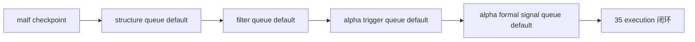

# downstream data-grade checkpoint alignment after malf 记录

记录编号：`35`  
日期：`2026-04-12`  
状态：`已补记录`

## 做了什么

1. 为 `structure / filter / alpha trigger / alpha formal signal` 补齐正式 `work_queue + checkpoint` 表族，并把这些常量与 bootstrap 入口导出为正式模块契约。
2. 重构四个 runner：显式 bounded 参数仍走旧的窗口物化路径；默认无窗口调用时切换到 queue/checkpoint 续跑路径。
3. 在 `structure` 中把 canonical `malf checkpoint(D/W/M)` 收敛成 `D` dirty scope，并用多周期 checkpoint 指纹驱动只读上下文 replay。
4. 在 `filter` 中把 `structure checkpoint` 作为唯一正式下游续跑来源，继续保持 `malf` 只作为最小上下文存在性校验。
5. 在 `alpha trigger` 中把 `filter checkpoint + detector candidate 范围/计数` 组合成 source fingerprint；在 `alpha formal signal` 中把 `alpha trigger checkpoint` 组合成正式续跑来源。
6. 补齐三份测试中的 queue/checkpoint 场景，验证默认无窗口运行、上游 fingerprint 变化触发 requeue、正式 checkpoint 落表。

## 偏离项

- `alpha trigger` 的 detector 输入暂未单独冻结成 `trigger_candidate checkpoint` 表族；本卡先用输入范围/计数与 `filter checkpoint` 组合成 source fingerprint，以避免越界扩展 detector ledger。
- 测试阶段的 `pytest --basetemp` 首轮因目录权限失败，最终改为显式创建正式 temp 路径后重跑；不影响正式代码与账本口径。

## 备注

- 当前 queue dirty 的正式锚点仍是 `D`；`W/M` 变化通过上游 checkpoint/fingerprint 进入 `D` replay，而不是直接给下游扩独立 `W/M` 事件主键。
- `36` 将继续处理 `malf` 波段寿命 sidecar；本卡不越界触碰概率 sidecar 物化。

## 记录图

