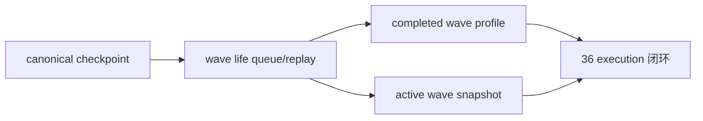

# malf wave life probability sidecar bootstrap 记录

记录编号：`36`  
日期：`2026-04-12`  
状态：`已补记录`

## 做了什么

1. 在 `src/mlq/malf/bootstrap.py` 中新增 `malf_wave_life_run / work_queue / checkpoint / snapshot / profile` 五表族，并把 `last_sample_version + source_fingerprint` 固化进 checkpoint/queue 契约。
2. 新增 `src/mlq/malf/wave_life_runner.py` 与 `scripts/malf/run_malf_wave_life_build.py`，把卡 36 的正式 runner 固定为：
   - 显式窗口参数走 bounded window 补跑
   - 默认无窗口调用走 canonical checkpoint 驱动的 queue/replay
3. 在 runner 中把 completed wave 样本与 active wave 快照分开建模：
   - completed wave 进入 `malf_wave_life_profile`
   - asof 活跃 wave 进入 `malf_wave_life_snapshot`
4. 当某个 `major_state + reversal_stage` 组别没有 completed wave 样本时，允许只读回退到 `malf_same_level_stats(metric_name='wave_duration_bars')`，保持 sidecar 可续跑可落表。
5. 补齐 `tests/unit/malf/test_wave_life_runner.py`，验证 profile/snapshot 分治和 queue rematerialize 行为。

## 偏离项

- 当前实现会在每次 run 中重写所选 timeframe 的 profile 全表，但 snapshot 只按被 claim scope 的 replay 窗口重算；这是为了维持 profile 全局统计真值，同时避免把非脏 scope 全量拖入 replay。

## 备注

- 当前 `wave life probability` 仍是 `malf` 外侧只读 sidecar，不回写 `malf core`，也不在本卡里直接扩展 `filter / alpha` 的正式消费字段。
- `36` 收口后，仓库执行主线恢复推进 `100-105` 的 trade/system 卡组。

## 记录图

