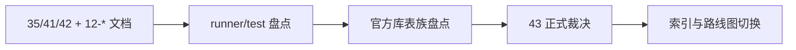

# structure/filter/alpha 达到 data-grade 质量门槛后再进入 position 记录

记录编号：`43`
日期：`2026-04-13`
状态：`已补记录`

## 做了什么

1. 先回读 `35 / 41 / 42` 已生效结论，以及 `12-*` 的设计/规格文档，把 `43` 的职责固定为“进入 `position` 之前的正式质量闸门”，而不是直接施工 `position`。
2. 盘点 `structure / filter / alpha` 的 runner、脚本入口与单元测试，确认 canonical 输入约束、默认 `checkpoint_queue` 路径、`source_fingerprint` 驱动 rematerialize，以及 `alpha formal signal -> position` 的最小消费链路已经在代码侧成立。
3. 直接盘点 `H:\Lifespan-data` 下 `malf / structure / filter / alpha` 官方库，确认当前物理账本仍缺 canonical `malf` 表族与 downstream `work_queue / checkpoint` 表族，不能把“代码已支持”误写成“官方账本已达标”。
4. 基于“代码合同已成立、官方本地账本仍未硬化完成”的差异，冻结 `43` 的正式裁决：允许继续进入 `44 -> 46` 的硬化链，但不允许直接进入 `47 -> 55`，更不允许恢复 `100 -> 105`。
5. 回填 `43` 的 evidence / conclusion，并同步更新执行索引与系统路线图，把最新生效结论锚点切到 `43`、当前待施工卡切到 `44`。

## 偏离项

- 本卡没有直接运行会改写 `H:\Lifespan-data` 的官方 smoke/replay 脚本。
  原因是前置盘点已经证明官方库缺少 `malf_state_snapshot` 与下游 `work_queue / checkpoint` 表族；在这种前提下直接跑 `44` 范围内的脚本只会把“缺少前置账本”与“脚本自身稳定性”混在一起。本卡把这件事显式下放给 `44 / 45` 作为正式硬化任务处理。

## 备注

- `43` 的“接受”仅表示允许继续 `44 -> 46` 的 pre-position 硬化链，不表示已经允许进入 `position`。
- `44` 负责把 `structure / filter` 的官方库 replay/smoke 证据补齐，`45` 负责把 `alpha formal signal` 的正式 producer 合同补齐，`46` 负责做 integrated acceptance。
- 只有 `46` 接受后，`47 -> 55` 才能恢复；只有 `55` 接受后，`100 -> 105` 才能恢复。

## 记录结构图

