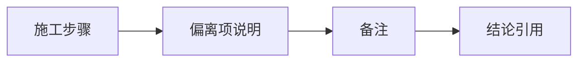

# structure/filter 官方 ledger replay 与 smoke 硬化 记录

记录编号：`44`
日期：`2026-04-13`

## 做了什么

1. 盘点 `structure / filter` 官方 ledger 路径与 queue 运行口径
2. 验证 replay / smoke 证据并回填结论

## 偏离项

- 无，或说明偏离原因

## 备注

- 若官方库 smoke 暴露新缺口，需在本记录中写明阻断项
- 本卡通过后才能进入 `45`

## 记录结构图

