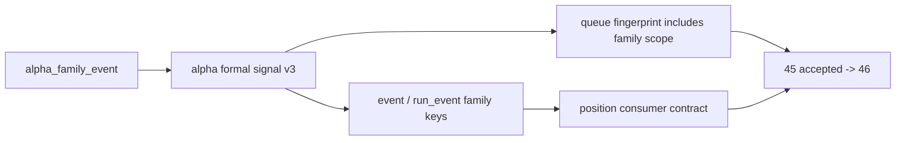

# alpha formal signal producer 在进入 position 前硬化记录

记录编号：`45`
日期：`2026-04-13`

## 做了什么
1. 在 `src/mlq/alpha/formal_signal_shared.py` 中新增 `DEFAULT_ALPHA_FORMAL_SIGNAL_FAMILY_TABLE='alpha_family_event'`，把 formal signal 合同版本提升为 `alpha-formal-signal-v3`，并为 formal signal event row 引入 family-aware 字段。
2. 在 `src/mlq/alpha/bootstrap.py` 中扩展 `alpha_formal_signal_run / event / run_event` DDL 与 required column 映射，确保正式账本可以物理落列。
3. 在 `src/mlq/alpha/formal_signal_source.py` 中增加 family source 读取逻辑：
   - 从 `alpha_family_event` 解析 `payload_json`
   - 构建 `trigger_event_nk -> family row` 映射
   - 将 family scope fingerprint 纳入 queue/checkpoint 的 `source_fingerprint`
4. 在 `src/mlq/alpha/runner.py` 与 `src/mlq/alpha/formal_signal_materialization.py` 中把 `source_family_table` 与 family map 串入 bounded build / checkpoint queue / materialization / run 审计 / event upsert 全路径。
5. 在 `scripts/alpha/run_alpha_formal_signal_build.py` 中补充 `--source-family-table` CLI 参数，统一脚本入口契约。
6. 在 `src/mlq/position/position_shared.py` 与 `src/mlq/position/runner.py` 中扩展 `PositionFormalSignalInput` 与 alpha select SQL，使 `position` 能读取 family-aware 新列，同时对旧表缺列保持 `NULL` fallback。
7. 在 `tests/unit/alpha/test_runner.py` 中补齐 family-aware 正向链路、queue replay 与 run_event 断言；在 `tests/unit/position/test_position_runner.py` 中补齐 position 消费新列的兼容测试。
8. 生成 `H:\Lifespan-temp\card45\family-aware-proof\summary\alpha_formal_signal_family_aware_proof.json` 与 `H:\Lifespan-report\card45\alpha-formal-signal-producer-inventory-readout-20260413.md` 作为本卡可追溯 proof。

## 关键实现判断
1. `45` 的核心不是再做一轮静态 inventory，而是把 `42` 已冻结的 family 解释层真正接入 formal signal 账本。
2. 仅把 family 键写入 event 表还不够，必须让 queue/checkpoint 感知 family-only 变化，否则 rematerialize 无法覆盖正式 producer 风险。
3. `position` 当前不要求立即以 family 新列作为 sizing 逻辑真值，但必须证明正式消费合同已经能稳定读取这些字段，并且不破坏旧表兼容。

## 兼容与边界
1. 若 `alpha_family_event` 表暂不存在，formal signal source 仍会回退为空 family map，并在 fingerprint 中记录 `family_table_present=False`；这是为了不破坏仓库内既有兼容测试，不代表正式主线默认口径。
2. `position` 的 select SQL 对 family-aware 列采用“有列即读、无列即 `NULL AS ...`”策略；这是消费合同兼容层，不等于允许回退到旧 producer 作为长期正式口径。
3. `45` 只解决 alpha producer 硬化，不代替 `46` integrated acceptance，也不提前解冻 `47 -> 55` 或 `100 -> 105`。

## 结果
1. `alpha formal signal` 已成为 family-aware 的正式 producer。
2. family-only 变化已能触发 queue replay 与 event rematerialize。
3. `position` 的正式消费合同已完成兼容升级。
4. `45` 可正式接受，当前施工位前移到 `46`。

## 记录结构图

