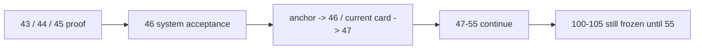

# 进入 position 前的 upstream acceptance gate 记录

记录编号：`46`
日期：`2026-04-13`

## 做了什么
1. 复核 `43 / 44 / 45` 的正式 conclusion、现有 evidence 与物理 proof 产物，确认 upstream 阻断已经从 `structure / filter / alpha` 清空。
2. 在切索引前运行 `python scripts/system/check_doc_first_gating_governance.py`，确认当前待施工卡 `46` 已具备 design / spec / task breakdown 与历史账本约束。
3. 通过 card44 summary 与 card45 proof 摘要做 acceptance 归并：
   - `card44-structure-run-2` 与 `card44-filter-run-2` 都留下 `rematerialized_count=1`、`checkpoint_upserted_count=1`
   - `card45` 已证明 `alpha formal signal v3` 物理接入 `alpha_family_event`，并在 family-only 变化下触发 queue replay
4. 回填 `46` 的 evidence / conclusion，把裁决写实为“允许进入 `47 -> 55`，但 `100 -> 105` 仍冻结到 `55`”。
5. 同步更新执行索引、路线图与入口文件，把：
   - 最新生效结论锚点切到 `46`
   - 当前待施工卡切到 `47`
6. 切索引后再次运行门禁与治理检查，确认后续可以按 `47` 继续正式施工。

## 关键实现判断
1. `46` 的职责不是再做一轮模块实现，而是把 `43 / 44 / 45` 的局部接受，升级成唯一正式的系统级准入裁决。
2. `44` 与 `45` 的 proof 已经足以证明 upstream 可以交付给 `position` 卡组；继续把施工位停在 `46` 只会让正式索引滞后于已成立的结论。
3. `46` 接受后，新的风险中心已前移到 `position -> portfolio_plan`，因此当前路线图和入口文件必须同步前移到 `47`。

## 偏离项

- 无新增偏离；本轮没有改动 `src/`、`scripts/` 下的业务实现，只做 acceptance 文档与执行索引切换。

## 备注

1. `46` 是 `47` 的唯一直接前置 acceptance 卡；若未来撤销本裁决，必须新开修复卡，不得直接回退为聊天结论。
2. `46` 接受不等于 `position` 已达 data-grade，只表示允许正式进入 `47 -> 55` 卡组。
3. 无论 `46` 是否接受，`100 -> 105` 都必须冻结到 `55`；本轮接受没有改变这一边界。

## 记录结构图

