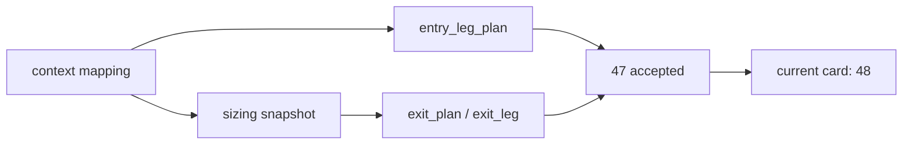

# position MALF 驱动仓位与分批合同冻结记录

记录编号：`47`
日期：`2026-04-14`

## 做了什么
1. 在 `src/mlq/position/position_bootstrap_schema.py` 中升级 `position` 正式表族：
   - 为 `position_policy_registry` 引入 `position_contract_version` 与 `entry/trim/exit schedule defaults`
   - 为 `position_candidate_audit / position_capacity_snapshot / position_sizing_snapshot` 引入 `context_behavior_profile / deployment_stage / schedule` 等正式字段
   - 新增 `position_entry_leg_plan`
   - 升级 `position_exit_plan / position_exit_leg`
   - 增加 schema evolution 补列逻辑，保证旧库可幂等升级
2. 在 `src/mlq/position/position_materialization.py` 中把旧 `_context_max_position_weight` 重构为 versioned mapping：
   - `malf_context_4 -> context_behavior_profile`
   - `lifecycle_rank_high / lifecycle_rank_total -> deployment_stage`
   - `(context_behavior_profile, deployment_stage) -> context_max_position_weight`
3. 在同一 materialization 路径中补齐最小分批与退出计划：
   - admitted 候选生成 `position_entry_leg_plan`
   - trim 生成 `position_exit_plan / position_exit_leg`
   - blocked 且已有持仓生成 `terminal_exit`
4. 在 `src/mlq/position/bootstrap.py`、`src/mlq/position/runner.py`、`src/mlq/position/position_shared.py`、`src/mlq/position/__init__.py` 中同步升级 summary、导出项与 bootstrap 调用。
5. 在 `tests/unit/position/test_bootstrap.py` 与 `tests/unit/position/test_position_runner.py` 中补齐 `47` 的正向验证，并确认 `tests/unit/portfolio_plan/test_runner.py` 不回归。

## 关键实现判断
1. `47` 的核心不是直接交付 data-grade runner，而是先把 `position` 的正式主语义从“单个 target weight”提升为“versioned context mapping + parameterized schedule + plan facts”。
2. `portfolio_plan` 当前仍只消费 `candidate / capacity / sizing` 三表；因此 `47` 必须保持这条 bridge 稳定，把 entry/exit 的新增语义放在 `position` 自己的正式账本层内扩展。
3. risk budget 的厚账本分解与 partial-exit 的更完整合同仍留给 `48 / 49`，本卡不越界完成。

## 兼容与边界
1. 旧 `position` 账本不会被删除；bootstrap 会先 `CREATE TABLE IF NOT EXISTS`，再执行 `ALTER TABLE ... ADD COLUMN IF NOT EXISTS`。
2. `portfolio_plan` 不需要读取 `position_entry_leg_plan / position_exit_plan` 才能继续工作；这是为了保证 `47` 收口后，`48` 可以在清晰的下游边界上继续硬化。
3. `position` 仍然不写 `trade` 或 `system` 事实；本卡只冻结计划层与账本层语义。

## 结果
1. `position` 已成为 MALF context 驱动的正式 sizing / batch contract 层。
2. `47` 可正式接受，当前待施工卡前移到 `48`。
3. `48 -> 55` 可以继续推进，`100 -> 105` 继续冻结到 `55` 之后。

## 记录结构图

