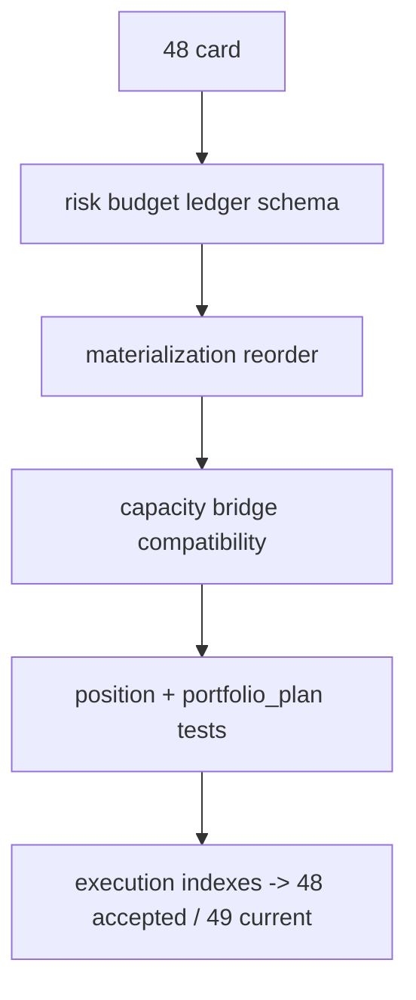

# position risk budget 与 capacity ledger 硬化记录

记录编号：`48`
日期：`2026-04-14`

## 做了什么
1. 在 [position_bootstrap_schema.py](H:/lifespan-0.01/src/mlq/position/position_bootstrap_schema.py) 中新增 `position_risk_budget_snapshot`，并同步升级：
   - `position_capacity_snapshot`
   - `position_sizing_snapshot`
   - 既有 schema evolution 补列逻辑
2. 在 [position_contract_logic.py](H:/lifespan-0.01/src/mlq/position/position_contract_logic.py) 中冻结 `48` 所需的正式语义：
   - `risk_budget_weight`
   - `binding_cap_code`
   - `capacity_source_code`
   - `risk_budget_snapshot_nk`
3. 在 [position_materialization.py](H:/lifespan-0.01/src/mlq/position/position_materialization.py) 中调整物化顺序：
   - 先落 `position_risk_budget_snapshot`
   - 再从厚账本派生 `position_capacity_snapshot`
   - 再写 `position_sizing_snapshot`
4. 在 [bootstrap.py](H:/lifespan-0.01/src/mlq/position/bootstrap.py)、[position_shared.py](H:/lifespan-0.01/src/mlq/position/position_shared.py)、[runner.py](H:/lifespan-0.01/src/mlq/position/runner.py) 中补齐 `risk_budget_count` 摘要口径。
5. 在 [test_bootstrap.py](H:/lifespan-0.01/tests/unit/position/test_bootstrap.py) 与 [test_position_runner.py](H:/lifespan-0.01/tests/unit/position/test_position_runner.py) 中补齐 `48` 的正式断言，并验证 `tests/unit/portfolio_plan/test_runner.py` 仍保持兼容。
6. 同步更新 execution 索引，把：
   - 最新生效结论锚点切到 `48`
   - 当前待施工卡切到 `49`

## 关键实现判断
1. `48` 的核心不是新增另一张汇总表，而是把 `risk budget / context cap / single-name cap / portfolio cap / final allowed weight` 拆成可追踪的正式厚账本。
2. `position_capacity_snapshot` 不能直接删除，因为 `portfolio_plan` 当前 bridge 仍只消费 `candidate / capacity / sizing`；因此本卡采用“厚账本为真值、capacity 为兼容派生”的策略。
3. `FIXED_NOTIONAL_CONTROL` 在本卡中被明确收敛为 operating baseline：
   - `risk_budget_weight` 以 fixed-notional baseline 进入正式账本
   - `SINGLE_LOT_CONTROL` 只保留在 family snapshot 中做 floor sanity
4. `binding_cap_code` 必须进入正式账本，否则下游无法回答“为什么被裁剪到这个权重”。
5. `50` 之前不越界做 `work_queue / checkpoint / replay`；本卡只冻结 ledger 结构与 materialization 语义。

## 偏离项
- 无新增偏离；本轮未改写 `portfolio_plan` 正式输入集合，也未提前进入 `49-50` 的 batched partial-exit / data-grade runner 施工范围。

## 备注
1. `position_materialization.py` 在本轮一度被推高到 800 行目标上限之外，随后通过共享 `_insert_once(...)` helper 收敛回 `715` 行，避免在改动路径上引入新的治理超长。
2. `check_development_governance.py` 仍非零退出，但只剩仓库既有历史债务；本卡未新增 position 路径治理违规。
3. `48` 接受不等于 `position` 已 data-grade；当前只表示 risk budget / capacity ledger 已完成正式硬化。

## 记录结构图

