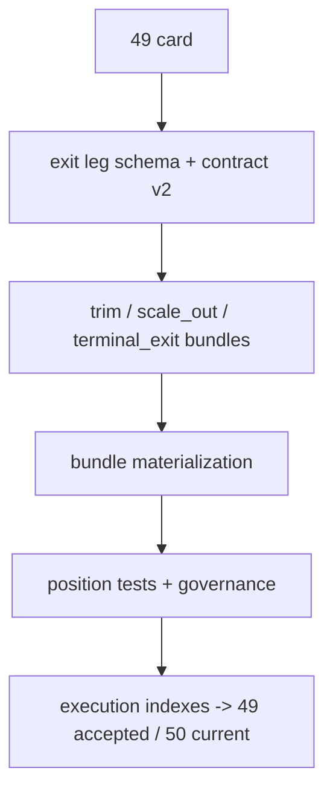

# position 分批进场、trim 与 partial-exit 合同冻结记录

记录编号：`49`
日期：`2026-04-14`

## 做了什么
1. 在 [position_bootstrap_schema.py](H:/lifespan-0.01/src/mlq/position/position_bootstrap_schema.py) 中把 `position` 默认合同版本前移到 `position-malf-batched-entry-exit-v2`，并为 `position_exit_leg` 补齐 `leg_gate_reason` 与 schema evolution 兼容补列。
2. 在 [position_contract_logic.py](H:/lifespan-0.01/src/mlq/position/position_contract_logic.py) 中把 `build_exit_plan` 升级为 `build_exit_plan_bundles`：
   - `trim` 改为正式 `trim` 计划腿
   - `NAIVE_TRAIL_SCALE_OUT_50_50_CONTROL` 可生成 `scale_out -> terminal_exit` 双腿计划
   - `closeout_by_exit_plan` 继续生成独立 `terminal_exit`
3. 在 [position_materialization.py](H:/lifespan-0.01/src/mlq/position/position_materialization.py) 中把单一 `exit_plan + exit_leg` 写入流程升级为 bundle 批量写入，并把 `sizing_snapshot_nk` 绑定到 `contract_version`。
4. 在 [test_bootstrap.py](H:/lifespan-0.01/tests/unit/position/test_bootstrap.py) 中新增 `scale_out` 场景断言，并把 trim 计划腿断言切到正式 `trim` 语义。
5. 在 [test_position_runner.py](H:/lifespan-0.01/tests/unit/position/test_position_runner.py) 中同步 runner 对新合同版本的断言。
6. 回填 `49` 的 evidence / conclusion，并同步刷新 execution 索引、路线图与入口文件，把当前待施工卡切到 `50`。

## 关键实现判断
1. `49` 的核心不是再加一套 exit family 宽表，而是把退出路径表达成“可审计的计划 bundle”。
2. `scale_out` 必须在 `position` 层先冻结为计划头与计划腿，不能等 `trade` 再反推，否则 `50` 无法做 leg-aware replay。
3. `exit_leg_nk` 不能继续依赖 `exit_leg_seq` 充当主语义；`seq` 只能保留排序职责，业务自然键必须回到 `candidate_nk + leg_role + schedule_stage + contract_version`。
4. `position_policy_registry` 需要把 active seed 前移到新合同版本，否则正式 runner 会继续以旧合同版本写新语义，导致历史账本版本边界混乱。
5. `trim` 与 `scale_out` 允许并存：
   - `trim` 负责当前超限时的保护性收缩
   - `scale_out` 负责非紧急 partial-exit 计划
   - 两者都只冻结计划，不越界生成成交或 PnL

## 偏离项
- 无新增偏离；本轮没有改写 `portfolio_plan` 输入集合，也没有提前进入 `50` 的 queue/checkpoint/replay 实现范围。

## 备注
1. 全仓治理检查仍只报既有历史超长文件；本轮通过按改动路径运行治理检查，确认 `position` 路径没有新增违规。
2. `position_action_decision` 仍保持 `trim_to_context_cap / hold_at_cap / closeout_by_exit_plan` 原语义，`49` 只升级计划腿合同，不改写上层动作裁决。
3. `50` 将以本卡冻结的 `entry_leg_nk / exit_plan_nk / exit_leg_nk` 为基础，补齐 leg-aware queue / replay / partial rematerialize。

## 记录结构图

