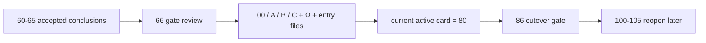

# mainline rectification resume gate 记录
`记录编号`：`66`
`日期`：`2026-04-15`

## 执行过程概述

本卡不新增正式业务代码，核心动作是把 `60-65` 已接受整改结论统一折叠为一个正式 resume gate，并把系统索引从“整改中”切换到“恢复 `78-84`”。执行过程分为三步：

1. 逐张复核 `60-65` 结论，抽取它们各自关闭的真实阻断项与边界约束。
2. 对照 `59` 的 `2010` pilot truthfulness template，判断这些阻断项是否已足以恢复 `78-84`，以及是否还需要继续追加整改卡。
3. 回填 `66` evidence / record / conclusion，并同步 `Ω` 路线图、执行索引与仓库入口文件，使当前待施工卡正式前移到 `90`。

## 关键记录

1. `66` 的判断结果是“恢复 `78-84`”，而不是“继续追加 `67+` 整改卡”。
2. `66` 放行的依据不是单独某一张卡，而是 `60-65` 的组合闭环：
   - `60` 负责登记批次与冻结顺序
   - `61` 修复 `structure / filter` 历史建库入口防呆
   - `62` 把 `filter` 拉回 pre-trigger 边界
   - `63` 证明 `wave_life` 官方 truth 与 bootstrap 路径成立
   - `64` 冻结 `stage × percentile` 的正式接入层
   - `65` 把 final admission authority 正式收回到 `alpha formal signal`
3. 复核后剩余未完成事项已不再属于“整改前置条件”，而是恢复卡组自身的工作：
   - `90-95` 分窗建库
   - `84` official cutover gate
   - `100-105` trade / system 后置恢复
4. `Ω` 路线图中的旧阻塞项已同步纠偏：
   - `alpha` 不再被记为“正式信号锚点未冻结”
   - `position / portfolio_plan` 不再被记为“仍缺少 data-grade 续跑语义”
   - 当前系统级阻塞聚焦到 `78-84`、`100-104` 与 `105`

## 变更清单

| 类型 | 路径 | 说明 |
| --- | --- | --- |
| 更新 card | `docs/03-execution/66-mainline-rectification-resume-gate-card-20260415.md` | 将 `66` 状态改为已完成 |
| 新增闭环 | `docs/03-execution/66-*-evidence/record/conclusion-20260415.md` | 补齐 `66` 正式执行闭环 |
| 更新执行索引 | `docs/03-execution/00-conclusion-catalog-20260409.md`、`A-execution-reading-order-20260409.md`、`B-card-catalog-20260409.md`、`C-system-completion-ledger-20260409.md` | 统一切换到 `66` 已接受、`90` 当前 active |
| 更新路线图 | `docs/02-spec/Ω-system-delivery-roadmap-20260409.md` | 同步 `66` gate 后的当前阶段、模块状态与阻塞项 |
| 更新入口 | `README.md`、`AGENTS.md`、`pyproject.toml` | 入口文件同步到 `66 -> 78 -> 84 -> 100` 的最新正式口径 |

## 收口判断

`66` 的完成标准不是“中间库已经恢复完”，而是“`60-65` 的整改项已经形成足以恢复 `78-84` 的正式闸门裁决，且仓库不再停留在口头判断状态”。本卡完成后，主线正式进入 `78-84`。

## 记录结构图

