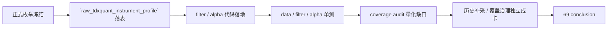

# filter 客观可交易性与标的宇宙 gate 冻结 记录

记录编号：`69`
日期：`2026-04-15`

## 做了什么？
1. 冻结 `filter_gate_code` 正式枚举为 `pre_trigger_passed / pre_trigger_blocked`。
2. 冻结 `filter_reject_reason_code` 正式枚举为五类客观 pre-trigger 拒绝原因：
   `security_suspended_or_unresumed / security_risk_warning_excluded / security_delisting_arrangement / security_type_out_of_universe / market_type_out_of_universe`
3. 在 `raw_market` 新增 `raw_tdxquant_instrument_profile`，把 `TdxQuant.get_stock_info(...)` 的客观状态按 `code + asset_type + observed_trade_date` 正式沉淀为可审计侧账本；`run_tdxquant_daily_raw_sync(...)` 现在和 `none` 日线原始事实一起落这份 objective profile。
4. 在 `src/mlq/filter` 落地 schema、source、materialization 与 shared contract；`run_filter_snapshot_build(...)` 现在只读消费 `raw_tdxquant_instrument_profile`，并把客观状态映射成正式 gate/reject code，同时继续把 `primary_blocking_condition / blocking_conditions_json` 保持为兼容镜像字段。
5. 在 `src/mlq/alpha/formal_signal_source.py` 改为优先读取正式 `filter_gate_code / filter_reject_reason_code`，仅对历史库保留 `trigger_admissible + primary_blocking_condition` 回退。
6. 新增 `src/mlq/filter/objective_coverage_audit.py` 与 `scripts/filter/run_filter_objective_coverage_audit.py`，只读审计官方 `filter_snapshot` 对 `raw_market.raw_tdxquant_instrument_profile` 的历史覆盖率。
7. 补 `tests/unit/filter/test_objective_coverage_audit.py`，并与 `data / filter / alpha` 相关单测一起通过串行 pytest 证据。

## 偏离项
- 当前已把真实官方客观状态源接入到 `filter`：来源是 `raw_market.raw_tdxquant_instrument_profile`。
- `2026-04-15` 新增只读 coverage audit 后，已把这个缺口量化：官方 `filter_snapshot` 当前共有 `6835` 行，时间范围 `2010-01-04 -> 2026-04-08`；而官方 `raw_market` 内尚不存在 `raw_tdxquant_instrument_profile`，因此生产库当前是 `6835 / 6835 = 100%` 的 objective coverage missing。
- 基于这次审计，历史 objective profile 覆盖不再适合继续作为 `69` 的尾项备注，而应拆成单独的“历史补采 / 覆盖率治理”后续卡；`69` 保留“合同冻结 + 正式接线 + 审计能力落地”的收口定位。

## 备注

- `69` 当前处于分步收口：本轮已完成“正式枚举与代码合同”“真实客观状态接入”与“只读 coverage audit 能力”；后续需另开卡处理历史生产库的 objective profile 回补与覆盖率治理。

## 记录结构图

