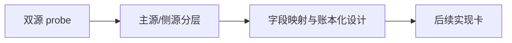

# 70-历史 objective profile 回补源选型与治理记录
`日期：2026-04-15`
`对应卡片：70-historical-objective-profile-backfill-source-selection-and-governance-card-20260415.md`

## 已执行动作

1. 新增 `data` 模块 `07` 号 design/spec，先把 source-selection 与治理边界冻结。
2. 在 card 中明确本轮只做 `Tushare / Baostock` 双源 bounded probe，不写正式 backfill runner。
3. 同步 execution 索引，将当前待施工卡从 `69` 切换到 `70`。
4. 在当前 Python 环境补装 `tushare`，完成 `Tushare` 与 `Baostock` 的第一轮和第二轮 bounded probe。
5. 将 probe 结果落到 `H:\Lifespan-report\data\objective-source-probe-20260415*.json/md`。
6. 结合官方文档，将 `stock_st` 的 `20160101` 起始约束与 `namechange` 的历史 ST 名称区间能力一并纳入判断。
7. 在 `70` 内继续把 probe 结论上提为正式字段映射与账本化设计，冻结 `Tushare 源事件账本 -> 官方 objective 日级 snapshot` 的两层结构。

## 偏离项

- 无代码偏离。
- 当前仍未进入正式 runner 实现，符合 `70` 的范围边界。

## 备注

- 需要特别关注 `Tushare` 的接口分层：
  - `st` 是更高权限的事件接口，当前账号不可用。
  - `stock_st` 当前账号可用，但官方明确只覆盖 `2016-01-01` 之后。
  - `namechange` 可以把更早历史中的 `ST/*ST/SST` 名称区间补出来。
- 当前主路径已冻结为：
  - 源事件账本：`tushare_objective_run / request / checkpoint / event`
  - 官方消费快照：`raw_tdxquant_instrument_profile`
- `Baostock` 当前仍只适合作为日级 `tradestatus / isST` 交叉验证源，不能直接承担正式主源。
- 当前 `TdxQuant get_stock_info(...)` 不带历史日期参数，这一点仍然阻止它进入历史真值主源候选。
- 下一步应单开实现卡，按 `Tushare` 四接口分别施工，不应重新回到无边界 probe。

## 记录结构图

