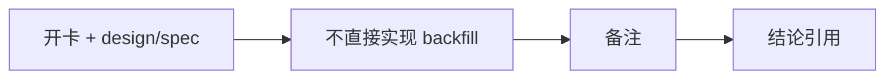

# 历史 objective profile 回补源选型与治理记录

`记录编号：70`
`日期：2026-04-15`

## 做了什么

1. 依据 `69` 结论新开 `70`，将“历史 objective profile 回补 / 覆盖率治理”从 `69` 尾项正式拆成独立卡。
2. 新增 `data` 模块 `07` 号 design/spec，先把 source-selection 与治理边界冻结。
3. 在 card 中明确本轮只做 `Tushare / Baostock` 双源 bounded probe，不写正式 backfill runner。
4. 同步 execution 索引，将当前待施工卡从 `69` 切换到 `70`。

## 偏离项

- 本轮没有继续推进生产库补采，也没有起正式 runner。
- 这是刻意的治理边界，不是遗漏：在历史真值语义未裁清前，不允许直接进入实现。

## 备注

- 需要特别关注 `Tushare st` 的权限门槛；当前本地参考只说明存在 token 备忘，不等于当前账号已满足全部接口权限。
- `Baostock` 当前更像日级状态与 universe 侧证源，是否足以单独承担正式历史真值源，需要后续 probe 裁定。
- 当前 `TdxQuant get_stock_info(...)` 不带历史日期参数，这一点会是后续结论的核心分叉点。

## 记录结构图

