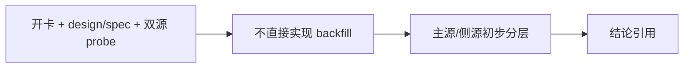

# 历史 objective profile 回补源选型与治理记录

`记录编号：70`
`日期：2026-04-15`

## 做了什么

1. 依据 `69` 结论新开 `70`，将“历史 objective profile 回补 / 覆盖率治理”从 `69` 尾项正式拆成独立卡。
2. 新增 `data` 模块 `07` 号 design/spec，先把 source-selection 与治理边界冻结。
3. 在 card 中明确本轮只做 `Tushare / Baostock` 双源 bounded probe，不写正式 backfill runner。
4. 同步 execution 索引，将当前待施工卡从 `69` 切换到 `70`。
5. 在当前 Python 环境补装 `tushare`，完成 `Tushare` 与 `Baostock` 的第一轮和第二轮 bounded probe。
6. 将 probe 结果落到 `H:\Lifespan-report\data\objective-source-probe-20260415*.json/md`。
7. 结合官方文档，将 `stock_st` 的 `20160101` 起始约束与 `namechange` 的历史 ST 名称区间能力一并纳入判断。

## 偏离项

- 本轮没有继续推进生产库补采，也没有起正式 runner。
- 这是刻意的治理边界，不是遗漏：在历史真值语义未裁清前，不允许直接进入实现。
- `Tushare` 的本地 token 读取在 Python 直接访问 `H:\。reference\...` 特殊路径时出现路径层异常，因此 probe 阶段改用运行时注入 token；这不影响接口层判定，但说明正式实现时不要把该参考目录路径当成稳定运行时契约。

## 备注

- 需要特别关注 `Tushare` 的接口分层：
  - `st` 是更高权限的事件接口，当前账号不可用。
  - `stock_st` 当前账号可用，但官方明确只覆盖 `2016-01-01` 之后。
  - `namechange` 可以把更早历史中的 `ST/*ST/SST` 名称区间补出来。
- `Baostock` 当前更像日级状态与 universe 侧证源，且北交所覆盖明显不足，不能直接承担正式主源。
- 当前 `TdxQuant get_stock_info(...)` 不带历史日期参数，这一点仍然阻止它进入历史真值主源候选。
- 第二轮 probe 后，初步方向已经清楚：
  - 主路径候选：`Tushare stock_basic + suspend_d + stock_st + namechange`
  - 辅助路径候选：`Baostock query_history_k_data_plus(..., tradestatus, isST)`

## 记录结构图

