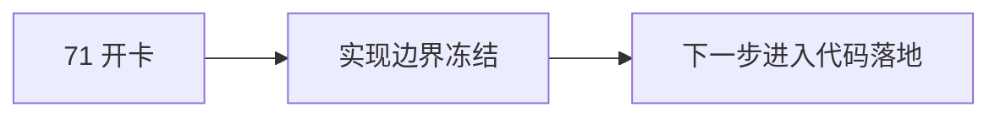

# 71-Tushare objective source runner 与 objective profile materialization 记录
`日期：2026-04-15`
`对应卡片：71-tushare-objective-source-ledger-and-profile-materialization-card-20260415.md`

## 已执行动作

1. 基于 `70` 的字段映射与账本化结论，正式新开 `71` 实现卡。
2. 新增 `data` 模块 `08` 号 design/spec，把 source sync runner 与 profile materialization runner 的正式边界冻结。
3. 将 execution 索引中的当前待施工卡从 `70` 切换到 `71`。
4. 明确本卡不再继续 `Tushare / Baostock` probe，而是直接进入 schema / runner / materialization 实现。

## 偏离项

- 当前仅完成 doc-first 开卡与实现边界冻结，尚未进入代码落地。
- 这是本卡的正常起步状态，不是遗漏。

## 备注

- `71` 将同时处理 source runner 与 materialization runner，避免 source schema 落地后再次等待下一张卡才能接通 `filter` objective coverage。
- `raw_tdxquant_instrument_profile` 现名继续保留，本卡不做 source-neutral 改名。
- `Baostock` 仍保留为后续对账侧证，不进入本卡正式写库路径。

## 记录结构图

