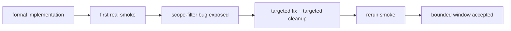

# 71-Tushare objective source runner 与 objective profile materialization 记录
`日期：2026-04-15`
`对应卡片：71-tushare-objective-source-ledger-and-profile-materialization-card-20260415.md`

## 已执行动作

1. 在 `src/mlq/data` 落地 Tushare 正式 client、source ledger runner、profile materialization runner 与 support/bootstrap helper。
2. 新增正式 CLI：
   - `scripts/data/run_tushare_objective_source_sync.py`
   - `scripts/data/run_tushare_objective_profile_materialization.py`
3. 扩展 `raw_market` bootstrap，使其正式承载：
   - `tushare_objective_run`
   - `tushare_objective_request`
   - `tushare_objective_checkpoint`
   - `tushare_objective_event`
   - `objective_profile_materialization_run`
   - `objective_profile_materialization_checkpoint`
   - `objective_profile_materialization_run_profile`
4. 扩展 `raw_tdxquant_instrument_profile`，补齐 `instrument_name / list_status / list_date / delist_date / source_owner / source_detail_json / first_seen_run_id / last_materialized_run_id` 等字段，同时保留 `filter` 当前仍在消费的既有字段。
5. 把 objective 相关 DDL/约束从 `src/mlq/data/bootstrap.py` 拆到 `src/mlq/data/bootstrap_objective_tables.py`，恢复 file-length 治理。
6. 在真实正式库上执行 bounded smoke：
   - source sync
   - profile materialization
   - filter coverage audit

## 偏差项

- 偏差：首次真实 bounded smoke 发现 `suspend_d / stock_st` 归一化时没有套用 `instrument_list` 过滤。
- 现象：
  - 首轮 source sync 错把 scope 外返回写入了 `tushare_objective_event`
  - 异常结果表现为：
    - `inserted_event_count = 975`
    - 覆盖 `201` 个标的
- 影响边界：
  - 影响仅限本次 smoke run 的 Tushare source 账本写入范围
  - 没有扩散到 `raw_tdxquant_instrument_profile`，因为在继续 materialization 前已停下修复

## 纠偏动作

1. 在 `src/mlq/data/data_tushare_objective.py` 中为 `suspend_d / stock_st` 增加 `scope_codes` 过滤。
2. 在 `tests/unit/data/test_tushare_objective_runner.py` 中加入非目标标的返回场景，确保 scope 不再外溢。
3. 定向清理错误 smoke run：
   - 仅删除 `run_id = smoke-tushare-source-20260415a` 对应的 `tushare_objective_{run,request,checkpoint,event}` 产物
   - 不回滚、不重置、不触碰其他历史账本
4. 重新执行 source sync，确认 source ledger 收敛到 `2` 条 event 的预期结果。

## 当前状态

- `71` 的最小正式实现已完成。
- 单测、治理检查、真实 bounded smoke 已形成闭环。
- 当前还未进入大窗口历史回补；后续是否扩大 bounded window，或单开“历史 objective profile 回补执行卡”，应在本卡收口后再决定。

## 记录结构图

