# 历史 objective profile 回补执行 记录

`记录编号：72`
`日期：2026-04-15`

## 做了什么

1. 基于 `71` 已接受的正式实现，裁定下一步不再在 `71` 内继续拉大 bounded smoke。
2. 正式新开 `72`，把当前待施工卡切换为“历史 objective profile 回补执行”。
3. 在 `72` 卡面中冻结了：
   - 全窗口回补范围：`2010-01-04 -> 2026-04-08`
   - 每批执行闭环：`source sync -> profile materialization -> coverage audit`
   - 允许的最小实现修复边界：`src/mlq/data / scripts/data / tests/unit/data`
4. 对正式库补跑了 `2010-01-04 -> 2026-04-08` 的 full-window coverage audit，确认当前 baseline 仍为：
   - `filter_snapshot = 6835`
   - `covered = 2`
   - `missing = 6833`
   - `missing_ratio = 0.9997073884418435`
5. 根据 audit 与正式库 readout 固化了首批建议窗口：
   - 首批 bounded window：`2010-01-04 -> 2010-12-31`
   - 首批 scope baseline：`1833` 个 `code`、`242` 个 `trade_date`
6. 用户提供正式 token 后，执行了 `72-backfill-source-2010a`，把 `2010` 首批窗口的 objective source ledger 正式写入 `16497` 条 event。
7. 首轮 `72-backfill-profile-2010a` 整窗 materialization 因外层超时中断，但已提交 `349758` 条 `2010` profile / checkpoint。
8. 为避免后续所有历史窗口都继续卡在“逐 profile 点查 + 单条事务”，对 `src/mlq/data/data_tushare_objective.py`、`src/mlq/data/data_tushare_objective_helpers.py` 与 `src/mlq/data/data_tushare_objective_support.py` 做了最小性能修复：
   - 预加载 existing checkpoint / profile state
   - materialization 改为分批提交
   - 去掉 per-profile 的重复 existence query
9. `72-backfill-profile-2010b` 在性能修复后再次整窗重跑，但由于仍会先重扫前段已完成 candidate，一小时内没有推进到剩余尾部缺口，因此再次被外层超时中断。
10. 通过正式库 readout 识别出剩余缺口集中在 `195` 个高代码标的，共 `42720` 条缺口 profile。
11. 执行 `72-backfill-profile-2010c`，只对剩余缺口标的重跑 materialization，最终补齐 `42720` 条缺口，另有 `117` 条 reuse。
12. 重新执行 full-window coverage audit，确认 `filter_snapshot` 已达到 `6835 covered / 0 missing`。

## 偏离项

- `72-backfill-profile-2010a` 与 `72-backfill-profile-2010b` 都因外层命令超时被人工终止，并在 `objective_profile_materialization_run` 中显式回填为 `failed`。
- 这两次失败不是 source/event 合同错误，也不是 profile 业务语义错误，而是 `2010` 整窗 materialization 在当前实现和本地 IO 条件下不能直接靠“整窗全量重扫”收口。
- 本卡最终采用“最小性能修复 + 剩余缺口定向重跑”补齐正式缺口，属于执行偏差后的 bounded recovery，不属于合同回退。

## 备注

- `72` 的目标不是重新证明 `71` 的 runner 可行，而是把已经可行的正式 runner 推进到全窗口历史回补。
- 后续若历史回补过程中暴露新的实现缺口，应继续在 `72` 内记录为执行偏差，而不是再退回 `70/71`。
- `72` 完成后，`2010-01-04 -> 2026-04-08` 窗口在当前 `filter_snapshot` 上已经没有 objective coverage missing，后续主线可以恢复到 `90`。

## 记录结构图

```mermaid
flowchart LR
    A["71 accepted"] --> B["stop expanding 71"]
    B --> C["open 72 execution card"]
    C --> D["freeze batch-execution boundary"]
    D --> E["full-window baseline audit"]
    E --> F["加载 token 并完成 source sync"]
    F --> G["2010a / 2010b 整窗 materialization 超时"]
    G --> H["最小性能修复"]
    H --> I["剩余 195 标的定向 materialization"]
    I --> J["full-window coverage = 0 missing"]
```

