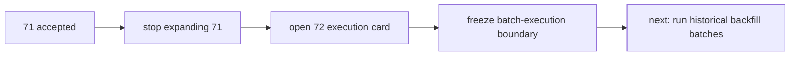

# 历史 objective profile 回补执行 记录

`记录编号：72`
`日期：2026-04-15`

## 做了什么

1. 基于 `71` 已接受的正式实现，裁定下一步不再在 `71` 内继续拉大 bounded smoke。
2. 正式新开 `72`，把当前待施工卡切换为“历史 objective profile 回补执行”。
3. 在 `72` 卡面中冻结了：
   - 全窗口回补范围：`2010-01-04 -> 2026-04-08`
   - 每批执行闭环：`source sync -> profile materialization -> coverage audit`
   - 允许的最小实现修复边界：`src/mlq/data / scripts/data / tests/unit/data`

## 偏离项

- 当前仅完成执行卡开卡与边界冻结，尚未开始 `72` 的首批历史回补。
- 这不是遗漏，而是本次动作只负责把路线从“71 内继续扩窗”正式切换到“72 独立执行卡”。

## 备注

- `72` 的目标不是重新证明 `71` 的 runner 可行，而是把已经可行的正式 runner 推进到全窗口历史回补。
- 后续若历史回补过程中暴露新的实现缺口，应继续在 `72` 内记录为执行偏差，而不是再退回 `70/71`。

## 记录结构图

