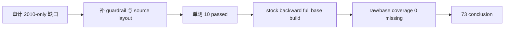

# market_base backward 全历史修缮与补全 记录

记录编号：`73`
日期：`2026-04-16`

## 做了什么

1. 开卡 `73`，把本卡定位为 `78 -> 84` 前的 data/raw/base 修缮卡，职责限定为补齐 `market_base(backward)` 全历史覆盖并修复补库执行口径。
2. 读取当前正式库后确认：
   - `raw_market.stock_daily_bar(backward)` 已覆盖 `16,348,113` 行、`5,501` 标的、`1990-12-19 -> 2026-04-10`。
   - `market_base.stock_daily_adjusted(backward)` 仅覆盖 `392,478` 行、`1,833` 标的、`2010-01-04 -> 2010-12-31`。
   - `stock backward` base 相对 raw 缺口为 `15,955,635` 行。
   - `index / block backward` 在施工前已与 raw 对齐，无需重跑。
3. 修改 `src/mlq/data/data_market_base_runner.py`：
   - 增加 `_should_delete_missing_market_base_rows(...)`。
   - 只有 `build_mode='full' + source_scope_kind='full' + effective_stage_limit is None` 时才允许删除缺失行。
   - 日期窗、标的窗或默认 limit 的 `full` 只做 upsert，不再删除同一 `adjust_method` 的范围外历史。
4. 修改 `src/mlq/data/data_raw_runner.py`：
   - 增加 `_resolve_tdx_daily_folder(...)`。
   - 保留旧布局 `{source_root}/{asset_type}/{adjust_folder}` 优先，同时兼容当前本地布局 `{source_root}/{asset_type}-day/{adjust_folder}`。
5. 修改 `tests/unit/data/test_market_base_runner.py`：
   - 新增局部 `full` 不删除范围外历史的回归测试。
   - 新增 `stock-day` source layout raw ingest 回归测试。
6. 执行 `python -m pytest tests/unit/data/test_market_base_runner.py -q`，结果 `10 passed`。
7. 执行正式补库：
   - `python scripts/data/run_market_base_build.py --asset-type stock --adjust-method backward --build-mode full --limit 0 --run-id card73-stock-backward-full-history-20260416`
   - 插入 `15,955,635` 行，复用 `392,478` 行，未发生重物化。
8. 执行补后覆盖审计，确认 `stock / index / block` 三类资产的 `backward` raw/base 缺口、额外行与数值 mismatch 均为 `0`。

## 偏离项

- 没有重跑 `TDX -> raw_market` 全量 ingest。
- 原因：正式审计已证明 `raw_market.stock_daily_bar(backward)` 本身就是全历史覆盖；当前本地 `H:\tdx_offline_Data` 已从历史 registry 中记录的 `stock/index/block` 布局变为 `stock-day/index-day/block-day` 布局。若在本卡直接全量重跑 raw ingest，会把同一标的的新 source path 重新登记进 file registry，增加不必要的 registry 噪声。
- 处理：代码已兼容 `*-day` 布局，后续真实 raw 增量可按新布局运行；本卡仅执行必要的 `raw_market -> market_base` 补库。

## 备注

- 全历史 `market_base stock backward` 补库耗时约 `2698.8s`。
- 本卡后，`malf -> structure -> filter -> alpha` 默认依赖的 `market_base(backward)` 已具备全历史正式覆盖。
- `run_market_base_build.py --build-mode full --limit 0` 是全历史重物化口径；带日期窗、标的窗或默认 limit 的 `full` 不再拥有全表缺失行删除权。

## 记录结构图

