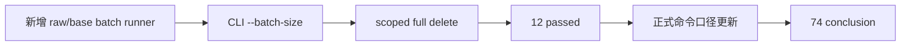

# market_base 分批建仓治理与 runner 修缮 记录

记录编号：`74`
日期：`2026-04-16`

## 做了什么

1. 开卡 `74`，把用户指出的“一次性全历史建仓内存不友好”问题登记为 `market_base` runner 正式修缮。
2. 修改 `src/mlq/data/data_raw_runner.py`：
   - 新增 `run_tdx_asset_raw_ingest_batched(...)`。
   - parent run 只读取候选文件名与 code 清单，不读取全历史行。
   - 每个 batch 调用既有 `run_tdx_asset_raw_ingest(...)`，并传入本批 instruments、`limit=0`、独立 child `run_id`。
3. 修改 `scripts/data/run_tdx_asset_raw_ingest.py`：
   - 新增 `--batch-size` 参数。
   - `--batch-size > 0` 时走批次编排，`--batch-size 0` 保持原单次 ingest 行为。
4. 修改 `src/mlq/data/data_market_base_runner.py`：
   - 新增 `run_asset_market_base_build_batched(...)`。
   - parent run 只读取 raw 中的 distinct code 清单，不 staging 全历史 rows。
   - 每个 batch 调用既有 `run_asset_market_base_build(...)`，并传入本批 instruments、`limit=0`、独立 child `run_id`。
   - parent summary 汇总 child run 结果，并保留 child run 明细。
5. 修改 `scripts/data/run_market_base_build.py`：
   - 新增 `--batch-size` 参数。
   - `--batch-size > 0` 时走批次编排，`--batch-size 0` 保持原单次 build 行为。
6. 修改 `src/mlq/data/data_market_base_materialization.py`：
   - `full` 删除缺失行时增加 instruments/date scope 条件。
   - instrument/date scoped full 只清理当前作用域内缺失行，不再拥有跨作用域删除权。
7. 更新 `src/mlq/data/runner.py` 与 `src/mlq/data/__init__.py`，导出 batched runner。
8. 新增 `tests/unit/data/test_market_base_batched_runner.py`：
   - 验证 raw ingest batch size 为 1 时产生多个 child run，且 raw rows 完整。
   - 验证 batch size 为 1 时产生多个 child run，且 market rows 完整。
   - 验证 instrument scoped full 只删除当前标的作用域内的缺失行。
9. 执行测试：
   - `python -m pytest tests/unit/data/test_market_base_batched_runner.py tests/unit/data/test_market_base_runner.py -q`
   - 结果 `13 passed in 17.94s`。

## 偏离项

- 本卡没有重跑正式 `H:\Lifespan-data` 的全历史补库。
- 原因：`73` 已完成正式库补齐，本卡目标是把建仓入口升级为可分批、可审计、可续跑的正式能力，避免对已完成的正式库重复写入。

## 备注

- 推荐正式批量建仓命令：
  - `python scripts/data/run_tdx_asset_raw_ingest.py --asset-type stock --adjust-method backward --run-mode full --batch-size 100`
  - `python scripts/data/run_market_base_build.py --asset-type stock --adjust-method backward --build-mode full --limit 0 --batch-size 100`
  - `index / block` 可按更小或同等 batch size 执行。
- 批次模式仍保持串行执行，避免多个 DuckDB writer 争用正式库。
- 如果某个 child run 失败，可用 evidence 中的 parent summary 找到失败前后的 child run，并按 `--instrument` 或剩余 code batch 定向重跑。

## 记录结构图

