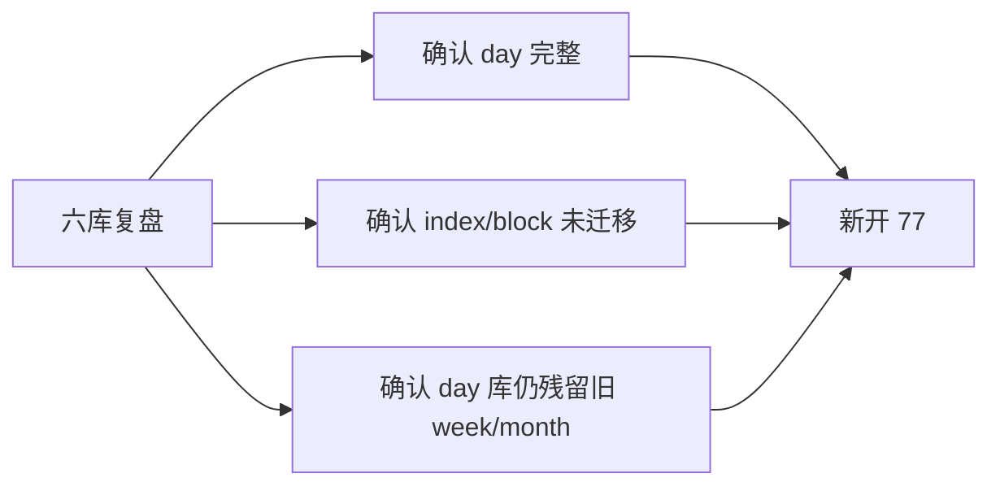

# raw/base 日周月分库迁移尾收口 记录

记录编号：`77`
日期：`2026-04-18`

## 做了什么

1. 重新盘点六个官方库，逐项核对 `stock/index/block × day/week/month × raw/base` 的实际完成度
2. 确认 `day` 数据已经在 `raw_market.duckdb / market_base.duckdb` 中完整存在
3. 确认新的 `week/month` 官方库目前只迁完了 `stock`，`index/block` 仍未迁入
4. 确认旧 `day` 库中仍遗留 `week/month` 价格表与历史数据，因此新开 `77` 作为尾收口卡

## 偏离项

- 本次只完成了新卡登记和范围冻结，没有进入新的代码实现或真实库 purge

## 备注

- `77` 不是推翻 `76`，而是承接 `76` 收尾，把“stock 已迁移”推进到“六库全部完成且旧 day 库周月已清”
- `80-86` 继续等待 `77` 完成后再恢复

## 记录结构图

