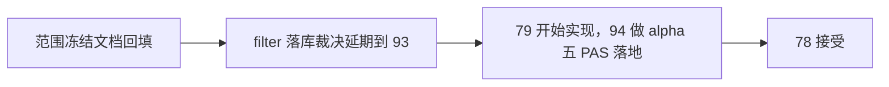

# malf alpha 双主轴重构范围冻结 记录

记录编号：`78`
日期：`2026-04-18`

## 做了什么

1. 回读 `18` 设计/规格、`78/79/80/81/82/83/84/85` 卡，以及执行区索引，确认当前新卡组已经建好，并补入 `0/1` 波段过滤专卡，防止 downstream 私带过滤口径。
2. 把 `18` 设计章程改成双主轴 + `malf` 三库 + `structure day/week/month` 三薄层 + `filter` 客观门卫 + `alpha` 五个 PAS 日线官方库的正式口径。
3. 把 `18` 规格改成：
   - `filter` 只冻结职责，不提前冻结独立本地库
   - `alpha` 改成 `alpha_bof / alpha_tst / alpha_pb / alpha_cpb / alpha_bpb`
4. 回填 `78/79/80/81/82/83/84/85` 卡面，确保后续切片不会再把 `structure/filter/alpha` 的边界写回旧口径。
5. 更新执行索引，把最新结论锚点推进到 `78`，并把当前待施工位切到 `79`。
6. 跑 doc-first gating、execution indexes 与 development governance 校验，确认本次只新增正式范围冻结文档，没有引入新的治理违规。

## 偏离项

- `filter` 是否还保留独立本地库，用户明确表示尚未定死，因此本次没有假装做出实现结论，只把该物理落库裁决明确延期到 `93`。

## 备注

- `78` 收口的是“范围冻结”，不是代码改造；因此当前推进到 `79` 代表可以开始路径契约实现，不代表 `malf/alpha` 已完成 cutover。
- `alpha` 五 PAS 日线分库是在 `78` 先冻结口径，真正路径和 replay 落地留给 `94`。

## 记录结构图

