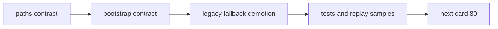

# malf 日周月分库路径与表族契约冻结 记录

`记录编号`：`79`
`日期`：`2026-04-18`

## 做了什么

1. 扩展 `WorkspaceRoots.databases`，正式暴露 `malf_day / malf_week / malf_month` 三库路径，并保留 `malf_legacy` 兼容回退位。
2. 在 `bootstrap_malf_ledger` 中引入 official native 与 legacy compat 两种模式，新增 `malf_ledger_contract` 并对 official native 表族施加单值 `timeframe` 约束。
3. 把仍依赖单库的 `malf snapshot / canonical / mechanism / wave_life` runner 显式改为 `use_legacy=True`，避免继续隐式宣称单库是默认官方库。
4. 补 `79` 专项单测，并回归 `structure / filter / alpha` 代表性样本。

## 偏离项

- 本卡没有提前实现 `80` 的 `0/1` 过滤裁决，也没有提前实现 `81` 的 timeframe native source rebind 或 `malf_day / week / month` 全覆盖；仍维持 legacy runner 明示回退，等待后续卡正式切换。

## 备注

- `DatabasePaths.malf` 继续保留为 legacy 兼容属性，避免一次性打断仍未切库的 downstream；正式官方路径改由 `malf_day / malf_week / malf_month` 显式承接。
- `79` 收口后，当前待施工位推进到新 `80`。

## 记录结构图

