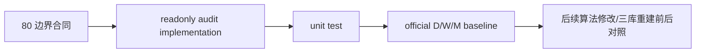

# malf 0/1 波段过滤边界冻结 记录

`记录编号`：`80`
`日期`：`2026-04-19`

## 做了什么

1. 新增 `src/mlq/malf/zero_one_wave_audit.py`，把 `0/1` 完成 wave 的统一只读审计逻辑固化成正式模块。
2. 新增 `scripts/malf/run_malf_zero_one_wave_audit.py`，作为 `80` 的正式只读审计入口，并把它写入 `README.md`、`AGENTS.md` 与 `pyproject.toml` 的入口清单。
3. 审计脚本实现采用聚合查询 + sample 查询 + 分时框 `COPY` 导出再合并的方式，避免在官方三库上一次性把全量短 wave 拉进内存。
4. 新增 `tests/unit/malf/test_zero_one_wave_audit.py`，覆盖 `same_bar_double_switch / stale_guard_trigger / next_bar_reflip` 三类分类以及 summary/report/detail 导出合同。
5. 回填 `79/80`、设计文档与规格文档，明确：
   - canonical truth 与 filtered consumption 必须分层
   - 任何 `canonical_materialization` 改写、`0/1` 消费合同调整或 `malf_day / malf_week / malf_month` 重建，都必须保留同口径的变更前/后审计结果
6. 对官方 `malf_day / malf_week / malf_month` 实际跑出一版全量基线，并把结果落到 `H:/Lifespan-report/malf/zero-one-wave-audit/`。

## 偏离项

- 本次没有直接改写 `canonical_materialization` 的 `switch_mode` 时序、`bar_count` 归属或 stale guard 合同。
- 本次没有重建 `malf_day / malf_week / malf_month`；只先把“改之前要怎么审、改之后要怎么对照”冻结清楚。

## 备注

- 真实三库跑数确认：短 wave 总量 `16,992,169`，其中 `stale_guard_trigger` 占 `14,085,407`，说明 `0/1` 问题的主量级确实来自 guard 长期失真后的放大，而不只是个别 `0 bar` 样本。
- `detail.csv` 是全量短 wave 明细，文件大小约 `3.90 GB`；后续若要比对 rebuild 前后差异，应优先复用同一路径下的 `summary.json` 与 `report.md` 做首轮对照，再按需抽查明细。
- `check_development_governance.py` 仍因仓库既有 backlog 返回 `1`，但未新增本任务相关治理违规。

## 记录结构图

