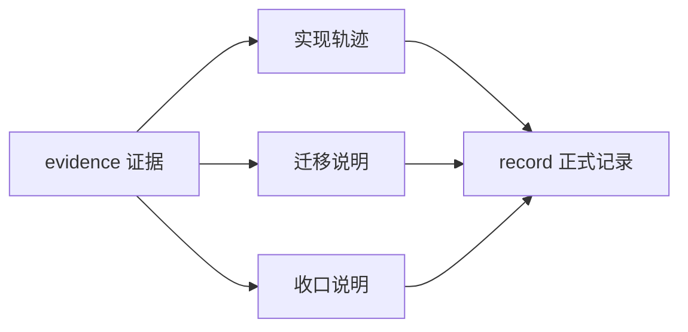

# 记录层

本目录用于保存正式工作的执行记录。

典型内容包括：

- 实现轨迹
- 迁移说明
- 收口说明
- 执行过程中形成的边界决策

## 流程图

```mermaid
flowchart LR
    EV[evidence 证据] --> REC_TRACE[实现轨迹]
    EV --> REC_MIG[迁移说明]
    EV --> REC_CLOSE[收口说明]
    REC_TRACE --> RECORD[record 正式记录]
    REC_MIG --> RECORD
    REC_CLOSE --> RECORD
```

