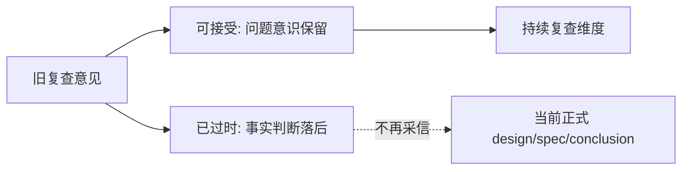

# 旧复查意见复核说明

日期：`2026-04-09`
状态：`参考冻结`

## 用途

本文用于复核一份较早阶段的外部/旧工作树复查意见，明确：

1. 哪些关注点仍然值得保留
2. 哪些判断已经不再符合当前主仓事实
3. 这类复查意见在新仓中应如何使用

本文属于 `reference` 层输入材料，不替代当前正式 `design / spec / execution conclusion`。

## 复核对象

本次复核对象的核心判断包括：

1. `doc-first` 仍然只是文档规则，还没有被工具硬门禁卡住
2. 历史账本共享契约还没有冻结成正式文档
3. `scripts/system/` 下没有对应的 `doc-first` 检查器
4. `docs/01-design/`、`docs/02-spec/` 仍只有早期几份文档

## 可接受部分

以下内容可以保留为“问题意识”或“审阅维度”：

1. 继续优先检查 `doc-first` 是否真的被工具卡住
2. 继续优先检查历史账本共享契约是否真的冻结成 formal 文档
3. 继续警惕“文档这么说，但工具没拦住”的回滑
4. 继续警惕正式环境与开发回退路径被混写

这些点作为复查重点是对的，后续仍值得持续复查。

## 已过时判断

以下判断不再适用于当前主仓 `H:\lifespan-0.01`：

### 1. “doc-first 仍然是规则，不是硬门禁”

当前主仓已经落地：

1. `scripts/system/check_doc_first_gating_governance.py`
2. `scripts/system/check_development_governance.py` 已串联该检查器

这意味着当前仓库已经具备正式的 `doc-first gating` 硬门禁，而不只是文档要求。

### 2. “历史账本共享契约还未冻结成正式文档”

当前主仓已经落地：

1. `docs/01-design/03-historical-ledger-shared-contract-charter-20260409.md`
2. `docs/02-spec/03-historical-ledger-shared-contract-spec-20260409.md`

其中已经正式冻结了：

1. 自然键优先
2. 审计字段与业务字段分层
3. 账本与快照分层
4. 五根目录来源优先级
5. `trade -> trade_runtime` 的命名映射

### 3. “scripts/system 下没有新增 doc-first 检查器”

该判断已经过时。

当前正式文件为：

1. `scripts/system/check_doc_first_gating_governance.py`

### 4. “docs/01-design / docs/02-spec 仍只有少量文档”

该判断也已经过时。

当前主仓除共享账本与 `doc-first` 文档外，还已经新增：

1. 系统级路线图设计宪章
2. 系统级路线图规格
3. 当前系统级总路线图
4. 模块级经验冻结文档

## 当前应如何使用这份旧复查意见

最合适的使用方式是：

1. 接受它的关注点
2. 不直接接受它的当前事实判断
3. 将其视为“早期阶段复查意见”，而不是“当前主仓正式结论”

## 当前正式参考顺序

如果要判断现在仓库的真实状态，应优先看：

1. `docs/01-design/03-historical-ledger-shared-contract-charter-20260409.md`
2. `docs/02-spec/03-historical-ledger-shared-contract-spec-20260409.md`
3. `docs/01-design/04-doc-first-gating-checker-charter-20260409.md`
4. `docs/02-spec/04-doc-first-gating-checker-spec-20260409.md`
5. `docs/02-spec/Ω-system-delivery-roadmap-20260409.md`
6. 对应执行结论文档

## 一句话结论

这份旧复查意见抓对了问题方向，但它对“当前仓库事实”的判断已经落后于主仓现状。

## 流程图

