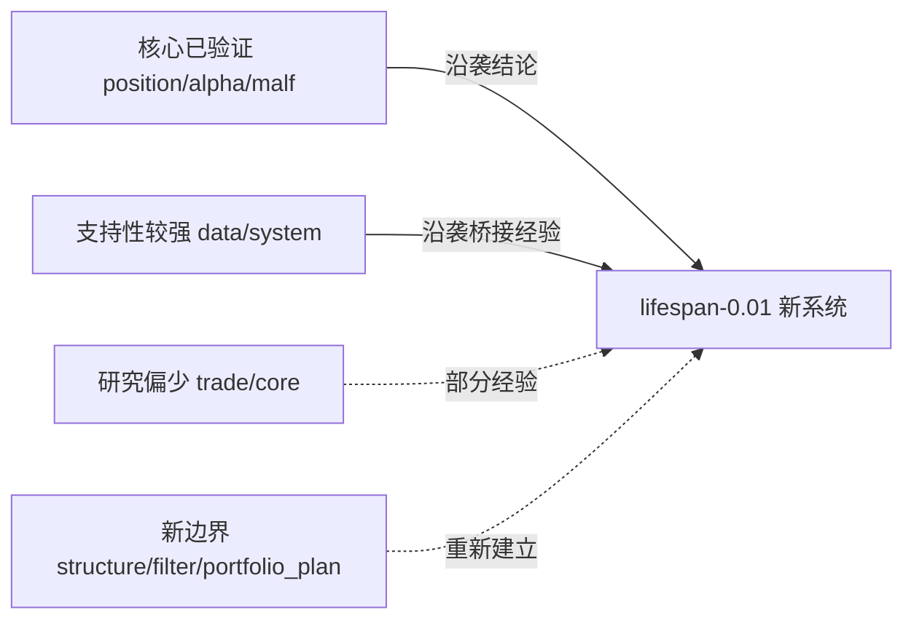

# 老仓模块来源图谱与路线图吸收底稿

日期：`2026-04-09`
状态：`Active`

## 目标

这份文档不直接建立新系统正式契约。

它只做一件事：

把 `lifespan-0.01` 当前系统路线图背后的老仓来源、继承方式与成熟度分层写清楚，避免后续继续施工时再次退回到“大家都知道哪些旧结论可用，但仓库里没有一张总表”的状态。

正式事实仍以：

1. `docs/01-design/`
2. `docs/02-spec/`
3. `docs/03-execution/*-conclusion-*.md`

为准。

## 来源分层

当前可供新系统吸收的老仓来源，按强度分为四层：

1. 核心已验证模块
   - `position`
   - `alpha`
   - `malf`
2. 支持性较强模块
   - `data`
   - `system`
3. 研究偏少模块
   - `trade`
   - `core`
4. 新边界模块
   - `structure`
   - `filter`
   - `portfolio_plan`

## 模块来源图谱

| 模块 | 主要来源 | 当前吸收方式 | 当前判断 |
| --- | --- | --- | --- |
| `position` | `G:\EmotionQuant-gamma\positioning\`；`G:\MarketLifespan-Quant\docs\01-design\modules\position\`；`G:\MarketLifespan-Quant\docs\02-spec\modules\position\`；`G:\MarketLifespan-Quant\docs\03-execution\` | 沿袭为主，账本物理形态改写 | 结论最扎实，适合作为下一锤 |
| `alpha` | `G:\EmotionQuant-gamma\normandy\`；`G:\MarketLifespan-Quant\docs\01-design\modules\alpha\`；`G:\MarketLifespan-Quant\docs\02-spec\modules\alpha\`；`G:\MarketLifespan-Quant\docs\03-execution\` | 沿袭为主，trigger ledger / formal signal 继续重写 | 可继承结论很多，但新账本分层必须重做 |
| `malf` | `G:\EmotionQuant-gamma\gene\`；`G:\MarketLifespan-Quant\docs\01-design\modules\malf\`；`G:\MarketLifespan-Quant\docs\02-spec\modules\malf\`；`G:\MarketLifespan-Quant\docs\03-execution\` | 语义吸收为主，结构产品化重写 | 实验最硬，但与 `structure / filter` 拆层后的正式合同仍待新系统重定 |
| `data` | `G:\MarketLifespan-Quant\docs\01-design\modules\data\`；`G:\MarketLifespan-Quant\docs\02-spec\modules\data\`；`G:\MarketLifespan-Quant\docs\03-execution\` | 沿袭为主 | `raw / base`、readiness、targeted repair 经验可直接复用 |
| `system` | `G:\MarketLifespan-Quant\docs\01-design\modules\system\`；`G:\MarketLifespan-Quant\docs\02-spec\modules\system\`；`G:\MarketLifespan-Quant\docs\03-execution\` | 吸收验收口径与主线桥接经验 | 结论很多，但新系统不能照搬旧命名与旧主线对象 |
| `trade` | `G:\MarketLifespan-Quant\docs\01-design\modules\trade\`；`G:\MarketLifespan-Quant\docs\02-spec\modules\trade\`；`G:\MarketLifespan-Quant\docs\03-execution\` | 只吸收经验，正式账本待新建 | 有桥接经验，但正式账本沉淀仍薄 |
| `core` | `G:\MarketLifespan-Quant\docs\01-design\modules\core\`；`G:\MarketLifespan-Quant\docs\02-spec\modules\core\`；`G:\MarketLifespan-Quant\docs\03-execution\` | 沿袭治理与契约，继续抽象重写 | 可复用治理、路径、contract 经验，业务层结论较少 |
| `structure` | `G:\Lifespan-Quant\docs\01-design\modules\structure\`；`G:\MarketLifespan-Quant\docs\01-design\modules\malf\29/30/31*` | 吸收想法与语义，正式模块全新建立 | 只有边界设想，没有新系统正式实现遗产 |
| `filter` | `G:\Lifespan-Quant\docs\01-design\modules\filter\`；`G:\MarketLifespan-Quant\docs\01-design\modules\malf\29/31/32*` | 吸收想法与最小硬门经验，正式模块全新建立 | 只有分层与最小硬门经验，没有稳定账本 |
| `portfolio_plan` | 旧 `position / system` 主线桥接与组合验收材料 | 由旧经验外推，新模块正式建立 | 老仓没有独立正式模块，只能谨慎外推 |

## 核心三模块为什么优先

### `position`

`position` 是当前最值得优先吸收的模块，因为它在老仓里同时具备：

1. 独立研究线
2. 分阶段执行卡
3. formal readout
4. sizing / partial-exit 的明确阶段裁决

尤其值得继续吸收的老结论有：

1. 先解“买多少”，再解“卖多少”
2. 先固定 baseline，再跑 family matrix
3. retained / no-go 必须靠长窗 replay 与正式 readout 裁决

### `alpha`

`alpha` 的强点在于：

1. `normandy/` 已经把触发事实、质量筛选、执行损伤诊断拆开
2. 老仓已经把 `PAS`、`formal signal`、桥接主线的经验沉淀成结论

新系统最该继承的是“分层纪律”，不是旧表名本身。

### `malf`

`malf` 的强点在于：

1. 老仓与 `gene/` 都积累了大量结构语义实验
2. 生命周期、语义场景、freshness、targeted repair 这些经验已经很扎实

新系统最该继承的是“市场语义层的约束和代价教训”，而不是把旧输出原样照搬。

## 当前不应误判成“已可直接沿袭”的点

1. `position` 的资金管理表族还没在新系统冻结。
2. `alpha` 的 `bof / tst / pb / cpb / bpb` 五表族还没正式落成新账本合同。
3. `malf` 与 `structure / filter` 的新边界虽然已裁决，但正式表合同还没建立。
4. `trade` 的 `entry / carry / exit / replay` 在新系统里仍然只是边界结论，不是账本成品。
5. `portfolio_plan` 在老仓没有完整独立模块，新系统必须自己建立正式合同。

## 一句话收口

当前新系统不该再把所有模块视为“从零开始”。

更准确的说法是：

`position / alpha / malf` 有最扎实的历史实验资产可吸收，`data / system` 有大量桥接经验可沿袭，`trade / core` 只有部分合同经验，`structure / filter / portfolio_plan` 则必须在吸收旧边界想法的基础上重新建立正式模块。`

## 流程图

