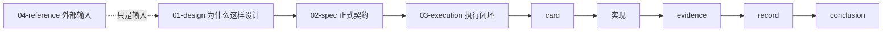

# 文档入口

`docs/` 是 `lifespan-0.01` 的正式治理入口。

本仓库继承老系统的文档纪律，并进一步强化“文档先行”：

1. 保留证据
2. 保留记录
3. 保留结论
4. 不允许代码生成跑在需求、设计和任务分解之前

## 推荐阅读顺序

如果你第一次进入本仓库，建议按下面顺序阅读：

1. `docs/01-design/00-system-charter-20260409.md`
2. `docs/01-design/01-doc-first-development-governance-20260409.md`
3. `docs/01-design/03-historical-ledger-shared-contract-charter-20260409.md`
4. `docs/01-design/04-doc-first-gating-checker-charter-20260409.md`
5. `docs/01-design/α-system-roadmap-and-progress-tracker-charter-20260409.md`
6. `docs/01-design/modules/README.md`
7. `docs/02-spec/00-repo-layout-and-docflow-spec-20260409.md`
8. `docs/02-spec/01-doc-first-task-gating-spec-20260409.md`
9. `docs/02-spec/03-historical-ledger-shared-contract-spec-20260409.md`
10. `docs/02-spec/04-doc-first-gating-checker-spec-20260409.md`
11. `docs/02-spec/β-system-roadmap-and-progress-tracker-spec-20260409.md`
12. `docs/02-spec/Ω-system-delivery-roadmap-20260409.md`
13. `docs/03-execution/README.md`

## 目录职责

### `docs/01-design/`

回答的问题：

- 系统为什么这样设计
- 模块正式边界是什么
- 当前生效的治理原则是什么

### `docs/02-spec/`

回答的问题：

- 仓库的正式契约是什么
- 实现前必须具备哪些文档
- 正式任务进入执行阶段的门槛是什么

### `docs/03-execution/`

这里不是普通笔记目录，而是正式执行闭环区。

默认闭环是：

`需求 -> 设计 -> 任务分解 -> 卡片 -> 实现 -> 证据 -> 记录 -> 结论`

进入执行区后，默认优先阅读：

1. `00-conclusion-catalog-20260409.md`
2. `00-card-execution-discipline-20260409.md`
3. `A-execution-reading-order-20260409.md`

如果只是追当前正式口径，先看 `conclusion`；
如果要继续某一项正式实现，再回到对应 `card / evidence / record`。

执行区目录还有一条不能遗忘的正式纪律：

1. `docs/03-execution/` 根目录只保留 `card / conclusion / index / template / README`
2. `evidence` 只能进入 `docs/03-execution/evidence/`
3. `record` 只能进入 `docs/03-execution/records/`
4. 把 `*-evidence-*` 或 `*-record-*` 直接放回根目录，属于正式治理违规，必须先回迁再继续施工
5. 后续新增执行文档默认通过执行文档 bundle 脚本生成，并由执行索引检查器持续守护

### `docs/04-reference/`

这里存放外部资料、书籍笔记、旧系统上下文和第三方材料。

这里的内容只是输入，不直接覆盖正式系统契约。

当前与路线图直接相关的参考输入，优先看：

1. `docs/04-reference/Γ-legacy-module-source-grounding-map-20260409.md`

## 硬规则

任何正式代码生成、代码改写、Schema 创建或 Pipeline 新增，都必须先具备：

1. 需求
2. 设计
3. 任务分解

只有满足这些前置文档后，任务才可以进入 `03-execution` 并产出代码。

## 流程图

